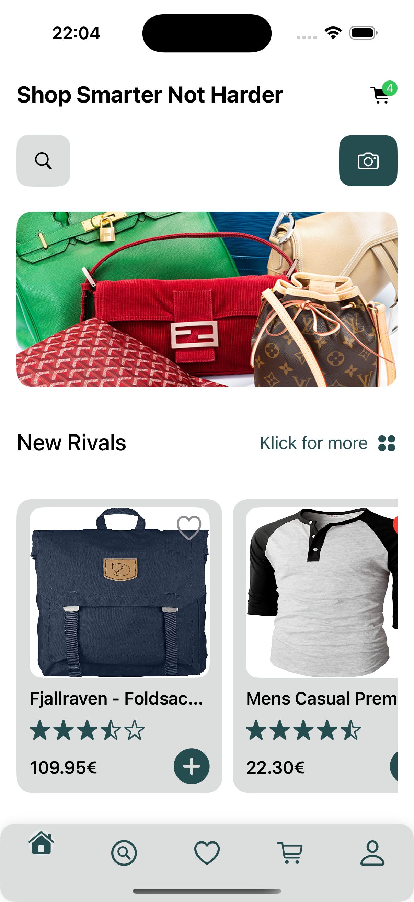
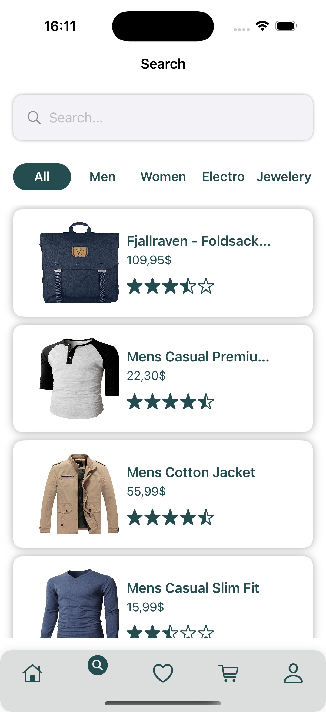
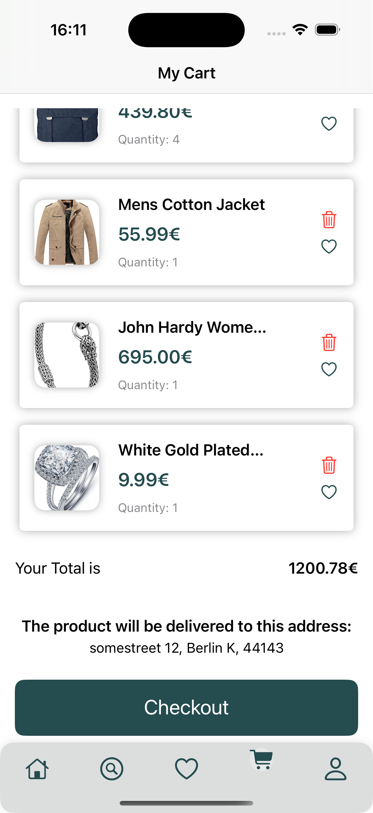
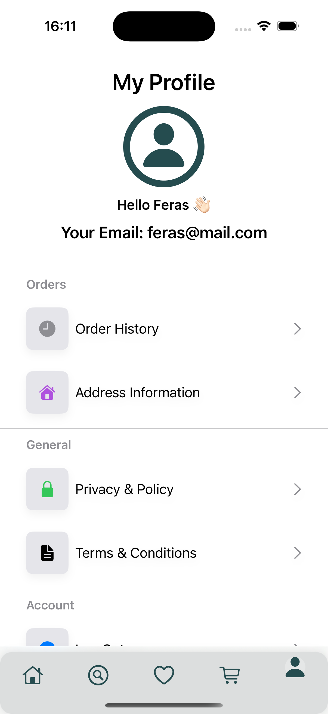
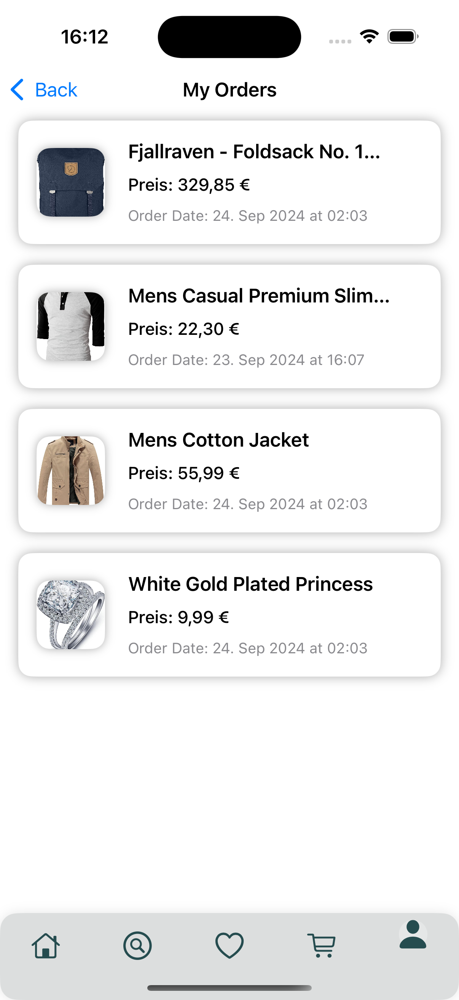

<div align="center">

<br/>

# 🛍️ Vendo
### *Shop smarter, not harder.*

<br/>


<br/>

> **Vendo** is a production-grade iOS shopping app built with SwiftUI and Firebase.  
> It delivers a seamless end-to-end commerce experience — from product discovery to order management —  
> wrapped in a clean, modern interface that puts the user first.

<br/>

</div>

---

## 📌 Overview

Vendo is more than a portfolio project — it's a fully functional commerce platform built on industry-standard technologies. The app enables users to browse curated product catalogs, manage a persistent cart, and track their orders, all backed by real-time Firebase infrastructure.

Designed with a mobile-first mindset, Vendo prioritizes speed, clarity, and intuitive interaction at every step of the user journey. The codebase follows strict MVVM separation of concerns, making it maintainable, testable, and ready to scale.

---

## ✅ Features

**Authentication**
- ✅ Secure user registration and login via Firebase Authentication
- ✅ Persistent session management across app launches

**Product Experience**
- ✅ Full product catalog with category-based filtering
- ✅ Detailed product pages including descriptions, pricing, and user reviews
- ✅ Responsive product grid optimized for all iPhone sizes

**Cart & Orders**
- ✅ Add, update, and remove items from a persistent cart
- ✅ Order overview with full item and pricing breakdown
- ✅ Order management interface for tracking purchase history

---

## 📱 Screenshots

<div align="center">

| Home | Search | Cart | Profile | Orders |
|------|---------|------|--------|---------|
|  |  |  |  |  |

</div>

---

## 🛠️ Tech Stack

| Layer | Technology |
|---|---|
| Language | Swift 5.9 |
| UI Framework | SwiftUI |
| Architecture | MVVM |
| Authentication | Firebase Authentication |
| Database | Firebase Firestore |
| Product Data | REST API (Fake Store API) |
| Target Platform | iOS 16+ |

---

## 🏗️ Architecture

Vendo follows the **MVVM (Model-View-ViewModel)** pattern — a clean architectural standard used across production iOS apps at scale.

```
Vendo/
├── Models/          # Data structures: Product, User, Order
├── ViewModels/      # Business logic, state management, data binding
├── Views/           # SwiftUI UI components and screens
├── Services/        # Firebase & REST API abstraction layer
└── Resources/       # Assets, color configs, constants
```

**Why MVVM?**  
MVVM enforces a strict separation between UI and business logic. Views stay declarative and lightweight. ViewModels handle all state and data transformation. This makes the app easier to test, extend, and hand off to a team.

---

## 🔌 API Integration

Vendo integrates with the **[Fake Store API](https://fakestoreapi.com)** to serve a realistic product catalog.

```
Base URL: https://fakestoreapi.com

GET /products           → Full product listing
GET /products/{id}      → Single product with details
GET /products/categories → Category list for filtering
```

The API layer is fully abstracted inside the `Services/` module, keeping ViewModels clean and the integration easy to swap out for a production backend when the time comes.

---

## 🔥 Data & Storage

| Data | Storage |
|---|---|
| User accounts | Firebase Authentication |
| User profiles | Firebase Firestore |
| Product catalog | Fake Store API + Firestore cache |
| Orders | Firebase Firestore |

All Firestore interactions are handled through a dedicated service layer, ensuring that data logic never bleeds into the UI.

---

## 💡 Why This Project Matters

Building a shopping app sounds straightforward — until you factor in real-time data sync, authentication state management, multi-screen navigation, and a cart that has to survive app restarts. Vendo addresses all of these challenges using the same tools and patterns found in production iOS apps at scale.

This project demonstrates:
- The ability to integrate multiple third-party services (Firebase, REST) into a coherent, clean architecture
- A strong grasp of SwiftUI's declarative UI paradigm and state management
- Production thinking: separation of concerns, reusable components, and a folder structure ready for team collaboration

---


## 👨‍💻 Author

Built with focus and intention by a developer who cares about clean code and real user experiences.

- 💼 Open to iOS developer roles and collaborations  
- 📬 Reach out via [GitHub Issues](../../issues) or connect on LinkedIn

<br/>

---

<div align="center">

*Vendo — Shop smarter, not harder.*  
Made with ❤️ using SwiftUI & Firebase

</div>
