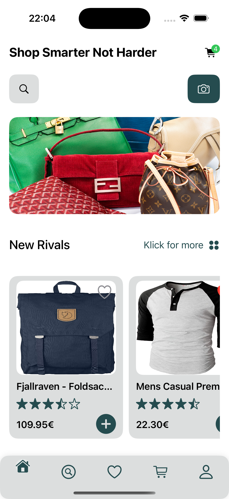

# Vendo App

"Shop smarter, not harder!"

Beschreibung: Unsere Shopping-App bietet eine einfache und intuitive Möglichkeit, Produkte zu durchsuchen und zu kaufen. Sie ist perfekt für alle, die Wert auf ein unkompliziertes und schnelles Einkaufserlebnis legen. Mit speziell zugeschnittenen Funktionen für Admins bietet sie auch eine effiziente Verwaltung von Produkten und Bestellungen. Was unsere App auszeichnet, ist die benutzerfreundliche Oberfläche und die nahtlose Integration von Funktionen, die sowohl für Käufer als auch für Verkäufer entwickelt wurden.

## Geplantes Design
Füge hier einige repräsentative Designs deiner App ein (z.B. aus Figma)

  
  
  
  
  

## Features
Hier kommen alle geplanten Features der App rein mit dem Status, ob es bereits umgesetzt wurde.

- [ ] Benutzeranmeldung und Registrierung: Erledigt
- [ ] Produktübersicht und -filterung : Erledigt
- [ ] Produktdetails und Bewertungen anzeigen: Erledigt
- [ ] Warenkorb-Funktionalität: Erledigt
- [ ] Bestellübersicht und -verwaltung: Erledigt

## Technischer Aufbau

#### Projektaufbau
Das Projekt ist nach dem MVVM-Architekturmuster aufgebaut, um eine klare Trennung zwischen Logik und Benutzeroberfläche zu gewährleisten. Hier eine kurze Übersicht der Ordnerstruktur:

Models: Enthält alle Datenmodelle der App, wie z.B. Product, User, Order.

ViewModels: Enthält die ViewModel-Klassen, die die Logik für die Views bereitstellen, z.B. LoginViewModel, ProductListViewModel.

Views: Enthält die SwiftUI-Views, die die Benutzeroberfläche darstellen, z.B. LoginView, ProductDetailView.

Services: Beinhaltet die Services für die Datenverarbeitung und API-Aufrufe, z.B. FirebaseService, ProductService.

Resources: Hier befinden sich statische Ressourcen wie Bilder und Konfigurationsdateien.

#### Datenspeicherung
Die App speichert verschiedene Arten von Daten:

Benutzerdaten: Gespeichert in Firebase Authentication und Firestore.
Produktdaten: Gespeichert in Firebase Firestore.
Bestellungen: Geplant zur Speicherung in Firebase Firestore.

#### API Calls
Diese App nutzt API Calls, um externe Inhalte darzustellen, darunter aktuelle Nachrichten und Trends aus der Modewelt.

Produkte aus der Fake-Produkt-API
Die in der App dargestellten Produkte werden von der Fake-Produkt-API geladen. Diese API dient ausschließlich zu Demonstrationszwecken und liefert keine echten Produktdaten. Die API wird genutzt, um die Funktionalität der App zu veranschaulichen.

API URL: https://fakestoreapi.com

## Ausblick
Nach der Fertigstellung des aktuellen Projekts gibt es noch viele Möglichkeiten zur Weiterentwicklung der App. Hier sind einige geplante Erweiterungen:

Integration eines In-App-Chats für den Kundensupport: Damit Kunden direkt Fragen stellen und Unterstützung erhalten können.

Erweiterung der Bestellverwaltung: Admins sollen detaillierte Statistiken über Bestellungen und Verkaufszahlen erhalten.

Push-Benachrichtigungen für Sonderangebote: Kunden werden direkt über neue Angebote und Preisnachlässe informiert.

Lokalisierung: Unterstützung für mehrere Sprachen, um die App international nutzbar zu machen.

Zu jedem dieser Punkte werde ich entsprechende Issues erstellen, um den Fortschritt der zukünftigen Entwicklungen zu verfolgen.
 
